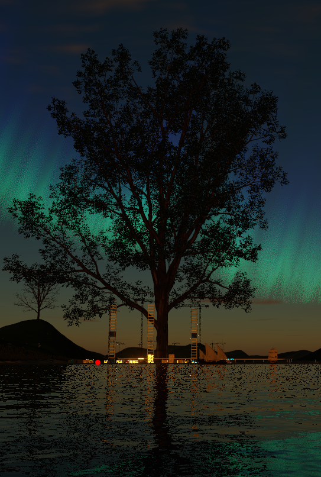

# ❄️ Metasiberia - metaverse from Siberia ❄️

Metasiberia is a virtual world project inspired by and based on the open-source Substrata software.

## Quick Access

- **🛠 Admin**: [https://vr.metasiberia.com/](https://vr.metasiberia.com/)
- **📝 Signup**: [https://vr.metasiberia.com/signup](https://vr.metasiberia.com/signup)
- **🌐 Web Client**: [https://vr.metasiberia.com/webclient](https://vr.metasiberia.com/webclient)
- **🏠 Website**: [https://metasiberia.com/](https://metasiberia.com/)

## Community and Support

## Credits

**Metasiberia** is inspired and based on **Substrata**.

