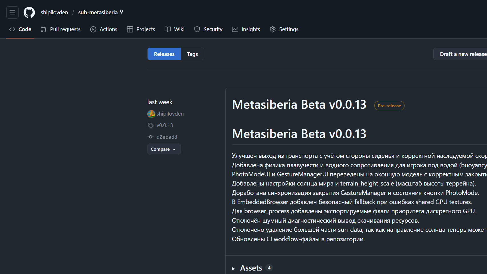

# Install (Windows)

Статус: draft  
Актуально для: Metasiberia Beta

> Для этой страницы ещё нужно собрать тематический пакет изображений:
> `hero`, `step-release-page`, `step-installer`, `result-installed`, `error-antivirus`.

## Что нужно перед установкой

- Windows 10/11 x64
- Доступ к интернету
- Права на установку программ

## Шаги установки

1. Откройте страницу релизов:  
   [https://github.com/shipilovden/sub-metasiberia/releases](https://github.com/shipilovden/sub-metasiberia/releases)

2. Скачайте последний установщик `MetasiberiaBeta-Setup-vX.Y.Z.exe`.
3. Запустите установщик и пройдите мастер установки.
4. Дождитесь завершения и нажмите `Finish`.
5. Запустите `Metasiberia Beta` через ярлык.

## Проверка результата

- Клиент запускается без ошибки.
- Появляется главное окно Metasiberia.
- В меню доступны пункты (`Edit`, `Movement`, `Avatar` и т.д.).

## Типичные проблемы

## Установщик не запускается

- Проверьте, что файл скачан полностью.
- Запустите установщик от имени администратора.
- Добавьте установщик в исключения антивируса (если он блокирует запуск).

## После установки приложение не стартует

- Перезагрузите ПК и попробуйте снова.
- Проверьте, не удалил ли антивирус файлы приложения.
- Переустановите клиент с последнего релиза.

## Изображения, которые ещё нужно добрать

- `hero.png` - тематический кадр установки Windows-клиента.
- `step-installer.png` - окно мастера установки.
- `result-installed.png` - установленный клиент или ярлык после установки.
- `error-antivirus.png` - типичный кейс с блокировкой или удалением файлов антивирусом.

## Полезные ссылки

- Главная wiki: [Home](Home)
- Регистрация и вход: [02 Registration and Login](02-Registration-and-Login)
