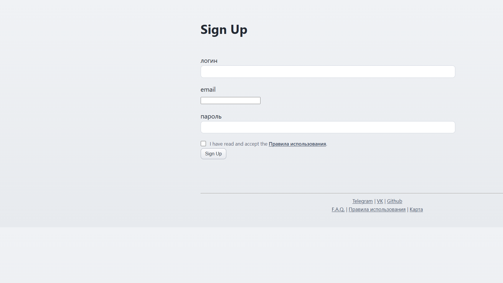

# Registration and Login

Статус: draft  
Актуально для: Metasiberia Beta

> Для этой страницы ещё нужно собрать тематический пакет изображений:
> `hero`, `step-signup-form`, `step-terms-checkbox`, `result-logged-in`, `error-invalid-credentials`.

## Регистрация аккаунта

1. Откройте страницу регистрации:  
   [https://vr.metasiberia.com/signup](https://vr.metasiberia.com/signup)

2. Заполните:
   - Username
   - Email
   - Password
3. Подтвердите чекбокс согласия с `Terms of use`.

4. Нажмите `Sign up`.

## Вход в клиенте

1. Запустите клиент Metasiberia.
2. Убедитесь, что есть подключение к серверу.
3. Откройте `LogIn`.
4. Введите username и password от зарегистрированного аккаунта.
5. Подтвердите вход.

## Проверка результата

- В правом верхнем углу отображается имя пользователя.
- Доступны действия, требующие авторизации.
- Можно перейти в личный мир через `Go -> Go to Personal World`.

## Типичные проблемы

## Ошибка входа (неверный логин/пароль)

- Проверьте раскладку клавиатуры.
- Убедитесь, что нет лишних пробелов.
- При необходимости выполните сброс пароля на сайте.

## Не удаётся зарегистрироваться

- Проверьте, что логин не занят.
- Убедитесь, что email введён корректно.
- Проверьте, что чекбокс `Terms` включён.

## Клиент пишет, что не подключён к серверу

- Проверьте интернет.
- Перезапустите клиент.
- Повторите вход после восстановления соединения.

## Изображения, которые ещё нужно добрать

- `hero.png` - тематический кадр страницы регистрации или входа.
- `result-logged-in.png` - клиент или сайт после успешной авторизации.
- `error-invalid-credentials.png` - пример ошибки неверного логина или пароля.

## Полезные ссылки

- Главная wiki: [Home](Home)
- Установка: [01 Install Windows](01-Install-Windows)
