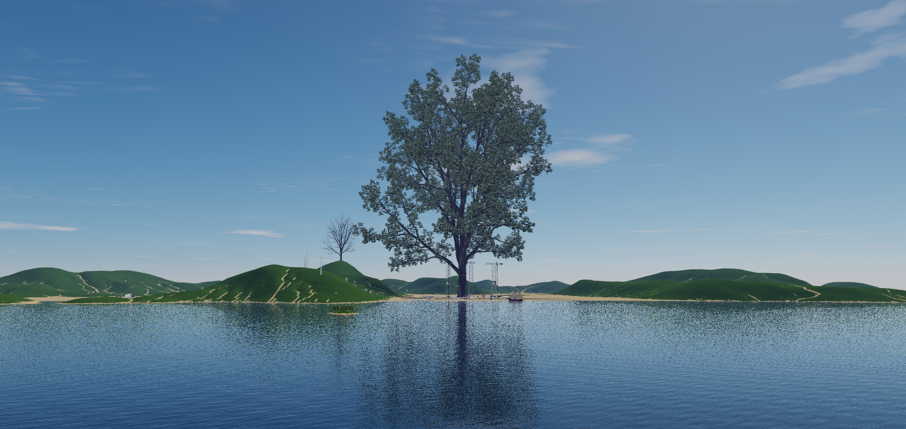

# Metasiberia Wiki

Документация по клиенту, созданию контента и администрированию Metasiberia.

## Быстрый старт

1. Скачайте последнюю версию клиента:  
   [Releases](https://github.com/shipilovden/sub-metasiberia/releases)
2. Установите `MetasiberiaBeta-Setup-vX.Y.Z.exe`.
3. Зарегистрируйтесь на сайте:  
   [https://vr.metasiberia.com/signup](https://vr.metasiberia.com/signup)
4. Запустите клиент и войдите в аккаунт.
5. Откройте базовые гайды:
   - [01 Install Windows](01-Install-Windows)
   - [02 Registration and Login](02-Registration-and-Login)

## Что уже опубликовано

- [01 Install Windows](01-Install-Windows)
- [02 Registration and Login](02-Registration-and-Login)
- [03 First Launch and Connection](03-First-Launch-and-Connection)

## Что делаем дальше по порядку

1. `04 Client UI Overview`
2. `05 Movement and Camera Modes`
3. `06 Graphics Audio Mic Webcam Settings`
4. `07 Troubleshooting Startup and Login`
5. `08 FAQ Quick Answers`

После этого закрываем блок `B. Add-операции`, затем `C. Редакторы и настройки`, затем `D. Медиа/миры/web`, `E. Админка`, и в конце `F. Lua scripting`.

## Разделы Wiki (план)

- Старт и база
- Add-операции (модели, видео, webview, аудио, воксели, камера и т.д.)
- Редакторы и настройки (Object/Material/Parcel/World/Environment)
- Медиа, миры, веб
- Админка
- Lua scripting

Полная структура страниц и порядок внедрения:
- [WIKI PAGES PLAN RU](WIKI-PAGES-PLAN-RU)

## Статус документации

- Сейчас Wiki находится в фазе расширения.
- Публично опубликованы `Home`, `01 Install Windows`, `02 Registration and Login`, `03 First Launch and Connection`.
- Источник правок: `C:\programming\substrata\docs\wiki`.
- Каждая новая страница должна содержать шаги, проверку результата, типичные ошибки и скриншоты.
